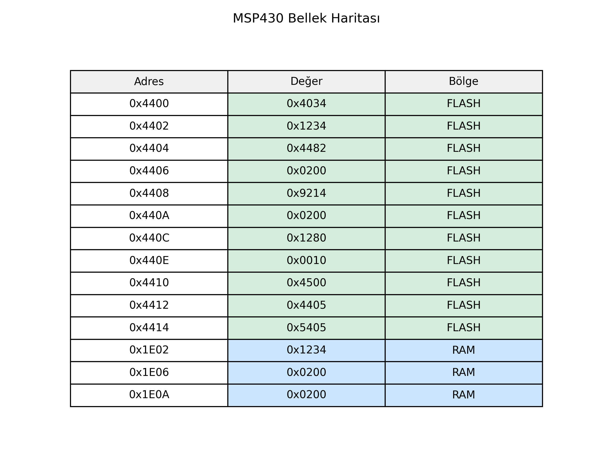

# MSP430 Assembler, Linker & Loader

Bu proje, MSP430 mimarisi için geliştirilmiş bir **assembler**, **linker** ve **loader** sisteminden oluşmaktadır. Python diliyle yazılmış olan bu sistem, assembly dilindeki kodları makine koduna çevirir, çoklu ELF dosyalarını birleştirerek tek bir çalıştırılabilir dosya oluşturur ve sanal bellek üzerinde programın yerleşimini simüle eder.

---

## Proje Yapısı

```
 Proje Klasörü
├── generate_test_elfs/        # Test için otomatik .elf dosyası üreticisi
├── linked_output.elf          # Linker çıktısı (birleştirilmiş ELF dosyası)
├── linker.py                  # Linker modülü (ELF birleştirme)
├── loader.py                  # Loader modülü (belleğe yerleştirme, çalıştırma)
├── main.asm                   # Ana assembly kod dosyası
├── main.elf                   # Ana .elf nesne dosyası
├── memory_map.png             # Bellek haritası görselleştirmesi
├── output.elf                 # Assembler çıktısı (tek ELF dosyası)
├── Rapor_1.pdf                # Proje raporu - Assembler tasarımı
├── Rapor_2.pdf                # Proje raporu - Derleyici mimarisi ve GUI
├── Rapor_3.pdf                # Proje raporu - Linker, loader ve sanal bellek
├── test4.py                   # Ek test dosyası
├── utils.asm                  # Yardımcı assembly modülü
├── utils.elf                  # utils.asm'den üretilmiş .elf dosyası
```

---

## Proje Bileşenleri

### Assembler (Python + Tkinter GUI)
- MSP430 assembly kodlarını iki geçişli derleyiciyle makine koduna çevirir.
- `main.asm` gibi dosyaları işleyerek `.elf` formatında nesne dosyaları üretir.
- GUI üzerinden kod yazma, sembol tablosu ve makine kodlarını görme imkanı sunar.

### Linker (`linker.py`)
- Birden fazla `.elf` dosyasını (örneğin `main.elf` ve `utils.elf`) alır.
- Sembolleri çözümler, relocation işlemlerini yapar.
- Sonuç olarak `linked_output.elf` dosyasını üretir.

### Loader (`loader.py`)
- Sanal bellek modeli (Flash, RAM, SFR, vs.) üzerinde ELF dosyasını belleğe yerleştirir.
- Relocation ve segment yerleşimi işlemlerini gerçekleştirir.
- Gerçek çalıştırma adreslerini belirleyerek programı simüle eder.

---

## Görseller

### Bellek Haritası


---

## Raporlar

- **Rapor_1.pdf** – Assembler tasarımı, opcode ve adresleme modları
- **Rapor_2.pdf** – Derleyici detayları, GUI yapısı, assembly direktifleri
- **Rapor_3.pdf** – Linker, loader, sanal bellek yapısı, ELF işleme

---

## Kullanılan Teknolojiler

- Python 3.x
- Tkinter (GUI)
- Custom assembler architecture
- ELF benzeri çıktı formatı
- Sanal bellek simülasyonu
- .macro, .equ, .ref, .global gibi assembler direktif desteği

---

## Başlatma Talimatı

1. Python 3 yüklü olduğundan emin olun.
2. GUI'yi başlatmak için:
   ```bash
   python assembler_gui.py
   ```
3. ELF dosyalarını birleştirmek için:
   ```bash
   python linker.py
   ```
4. Sanal bellekte ELF’yi yüklemek ve çalıştırmak için:
   ```bash
   python loader.py
   ```

---

## Geliştirici Ekibi

- Adem COŞKUN   
- Emine KAYIT
- Sedanur PEKER 
- Zeliha POLAT

---

## Notlar

- Proje eğitim amacıyla geliştirilmiştir.
- Gerçek MSP430 donanımı yerine sanal bellek ortamında çalışmaktadır.
- GUI üzerinden sembol ve literal tablosu da görsel olarak sunulmaktadır.

---
